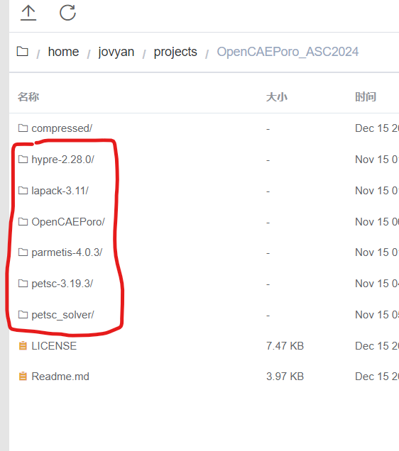

# Day 01
# 1. 深度学习环境配置
发现完全连不上 github, 因此将 DeepSpeed 和所有下文的项目迁移到 gitee 上.  

将 DeepSpeed clone 到服务器上的 ~ 内:
```
cd ~
git clone https://gitee.com/jamesnulliu/DeepSpeed.git
```

安装 DeepSpeed:
```
cd DeepSpeed
pip install .
```

# 2. 题目进展
## 2.1.

## 2.2. 设计推断引擎
部署位置: ~/projects/OpenBuddy

环境搭建完毕, 权重目前在下载中.

下载进程 pid: 771. **实例 2**.

**注意** 上线后请用指令 `watch -n 1 ps 771` 查看进程状态判断是否还在下载权重. 若下载完成请 @我.

请各位先看一下这篇文章, 了解一下[通过量化降低推断内存要求](https://r23456999.medium.com/%E5%A6%82%E4%BD%95%E5%88%A9%E7%94%A8%E9%87%8F%E5%8C%96%E5%9C%A8%E4%BD%8E%E8%B3%87%E6%BA%90%E6%83%85%E6%B3%81%E4%B8%8B%E5%9F%B7%E8%A1%8C70b%E7%9A%84llama2%E6%A8%A1%E5%9E%8B-98691acc7d81); 文章中说的 "量化" 和题目中禁止的低精度貌似不一样.

接着精读这篇[知乎](https://zhuanlan.zhihu.com/p/654585685?utm_id=0), 目前我正在下载权重, 环境已经搭建完成. **读一下推断代码, 已经用了上一篇文章说的量化方式进行推断!** 微调是需要有待讨论.

项目本身的开发者已经在开发自己的 [inference engine](https://github.com/OpenBuddy/GrandSage)! **这个引擎是基于 vLLM 的!**   

**我不知道上面知乎文章做的推断是否用了上面我给了链接的开发者自己写的推断引擎, 如果用了, 那题目的意思是不是就是我们在这基础上改一改呢?**

题目要求我们自己设计推断引擎; 并且请注意这句话 "Despite the availability of optimized and high-performance inference frameworks such as TensorRT-LLM and vLLM, we encourage participants to begin with the baseline code and build a tailored, high-performance inference engine, considering the architectural characteristics of their HPC cluster. "  
我认为意思是参考 vLLM 加点我们自己的东西.

DeepSpeed 对推断也有自己的优化方式! [参考文章](https://www.deepspeed.ai/inference/).

最后: 我目前不太懂怎么把自己写的推断引擎嵌入到上面做的推断过程!


## 2.3. 石油模拟器
部署位置: ~/projects/OpenCAEPoro_ASC2024

所有压缩包已经解压, 路径如下图所示:
</img>

需要 cd 到每个文件夹内, 参考[官方文档](https://github.com/OpenCAEPlus/OpenCAEPoro_ASC2024)安装.

**注意** 一定要用 the Intel C/C++ compilers; cmake 已经安装无需额外部署.

compressed 文件夹内部是原始压缩包.

**建议** 安装前 configure 路径时建议把 ROOTDIR 设定为 ~/ProgramData (即所有软件同意安装在此目录下)

