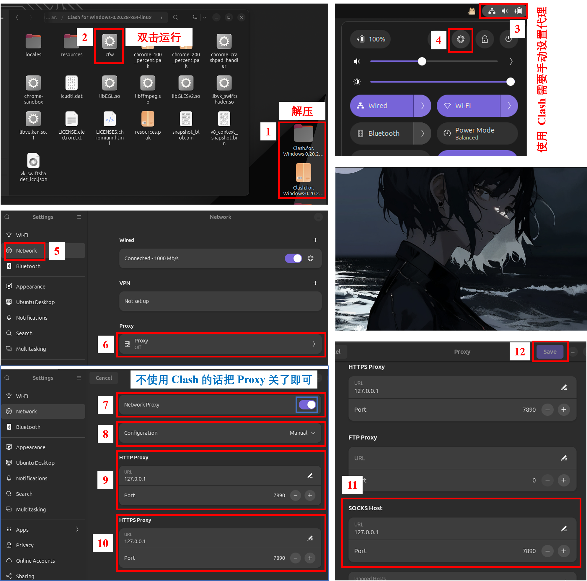
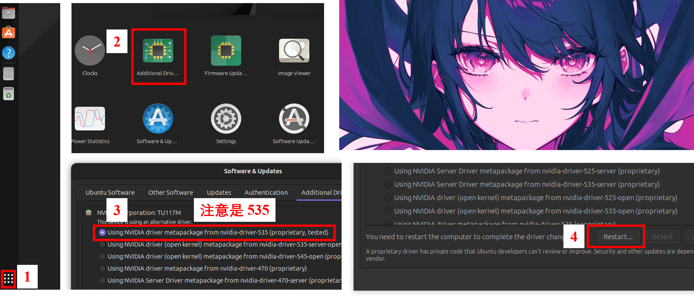
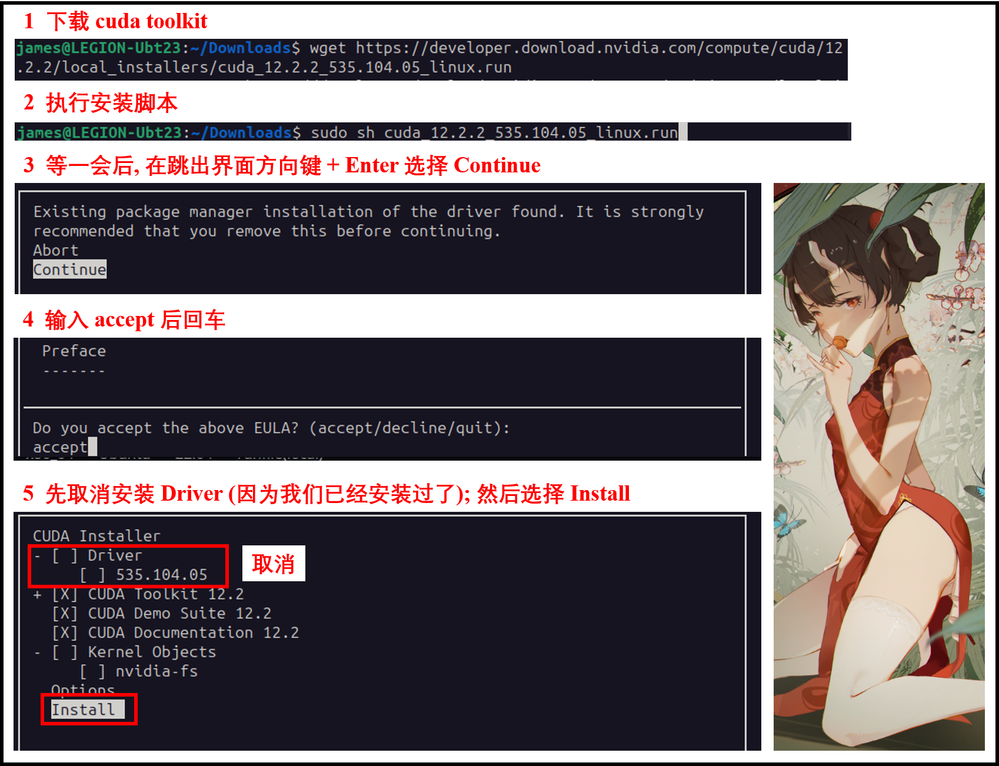
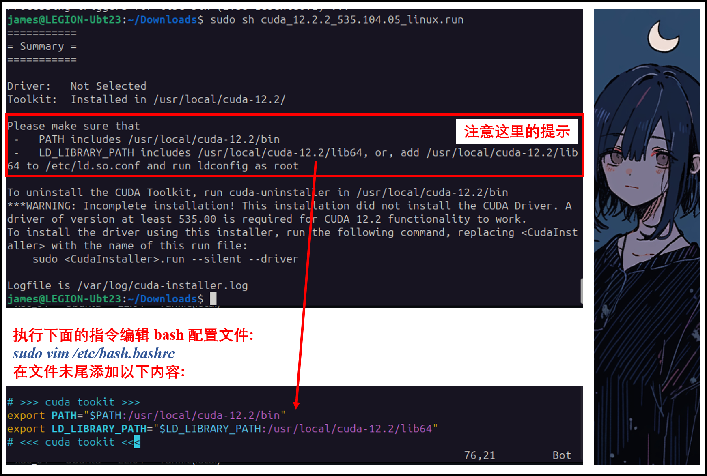

# Customize Linux

## 1. 安装 VIM (别告诉我你不会用 VIM)

先下载本文同级目录下的 [vimrc](https://github.com/jamesnulliu/My_Notes/blob/main/Linux/vimrc) 文件至 "~".

```bash
sudo apt-get install vim-gtk3
sudo mv /etc/vim/vimrc /etc/vim/vimrc.bkp
sudo mv ~/vimrc /etc/vim
```

这个文件是 vim 的配置文件, 开启了一些额外功能.

如果你不会使用 vim, 安装完后, 请运行下面的指令开始 30 分钟的 vim 速成:

```bash
vimtutor
```

## 2. 使用 Clash for Windows (不会有不翻墙的程序员吧)

使用 Clash for Windows 需要手动设置 Proxy.

**如果关闭了 Clash, 则需要手动关闭 Proxy 才能正常联网.**

**建议一直开着 Clash, 不想翻墙切换成 Direct 模式就行了.**

</img>


## 5.3. [可选] 安装 Nvidia 驱动 (需要你的电脑有 N 卡)

如果你电脑没有 N 卡自然跑不了 Pytorch 捏~

本文选择安装了 535 版本的驱动, 目前 (2024/Feb/08) 测试没有 bug. 你可以结合自己的情况试试安装更新的驱动, 不过版本一定要记住, 后面安装 cuda tookit 要用到.

参考下图安装驱动:

</img>

安装完后重启一下, 接着我们继续安装 cuda toolkit.

先安装 Build Essentials, 也就是 gcc, g++, gdb:

```bash
sudo apt install build-essential
```

进入 [Cuda Tookit Archive 官网](https://developer.nvidia.com/cuda-toolkit-archive).

然后要注意, 当前最新 (2024/Feb/09) 的 cuda toolkit 是 12.3.2 (January 2024), 点进去选好操作系统 (Linux => x86_64 => Ubuntu => 22.04 => runfile) 后可以看到下载指令如下:

```bash
wget https://developer.download.nvidia.com/compute/cuda/12.3.2/local_installers/cuda_12.3.2_545.23.08_linux.run
```

**但是我们前面安装的是 535 版本的驱动, 上述指令下载的对应驱动是 545 版本. 因此出现了不匹配的状况.**

因此你在下载时, **需要结合你安装的驱动版本找到最新的与驱动版本匹配的 cuda toolkit**. 

对于 535 版本的驱动, 最新的匹配 cuda toolkit 应该是 [12.2.2 (August 2023)](https://developer.nvidia.com/cuda-12-2-2-download-archive?target_os=Linux&target_arch=x86_64&Distribution=Ubuntu&target_version=22.04&target_type=runfile_local).

点进去后选择操作系统 (虽然我们安装的是 Ubuntu 23, 但是 22.04 的 Cuda Tookit 也能装):

Linux => x86_64 => Ubuntu => 22.04 => runfile(local)

可以看到跳出下面的两条指令; 第一条是下载 cuda tookit 安装程序, 第二条是安装 cuda tookit:

```bash
# [Warning] Following commands are just an example. You should get your command from the offical website: https://developer.nvidia.com/cuda-toolkit-archive

# Download cuda toolkit
wget https://developer.download.nvidia.com/compute/cuda/12.2.2/local_installers/cuda_12.2.2_535.104.05_linux.run
# Run installation script
sudo sh cuda_12.2.2_535.104.05_linux.run
```

参考下图的步骤进行 cuda toolkit 的安装 (注意取消安装 Driver):

</img>

安装完后, 根据输出的提示, 利用指令 `sudo vim /etc/bash.bashrc` 在文件的末尾添加以下两行命令 (具体命令要你参考下图根据输出提示改, 不一定和我的一样):

```bash
export PATH="$PATH:/usr/local/cuda-12.2/bin"
export LD_LIBRARY_PATH="$LD_LIBRARY_PATH:/usr/local/cuda-12.2/lib64"
```

</img>

安装完后, 把当前终端关闭, 开个新终端, 输入以下指令检查 cuda toolkit 是否安装成功:

```bash
nvcc -V
```


## 5.4. Visual Studio Code
### 5.4.1. 安装
```bash
sudo snap install code --classic
```
### 5.4.2. 配置

```bash
mkdir ~/Projects
cd ~/Projects
mkdir test
code test  # Open "test" folder as a project with vscode
```

## 5.5. 搭建 C++ 开发环境

```bash
sudo apt install build-essential  # Install gcc-13, g++-13, gdb.
# gcc-11 and g++-11 is also needed if you want to do cuda-programming.
sudo apt install gcc-11
sudo apt install g++-11
```

## 5.6. 搭建 Python 开发环境
