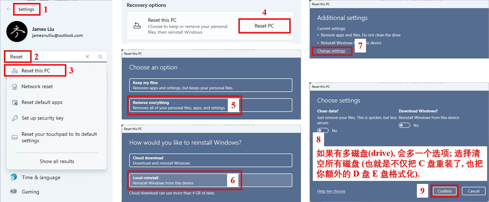
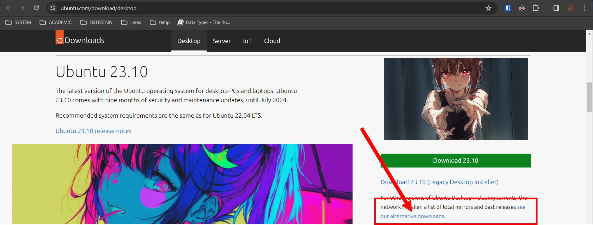
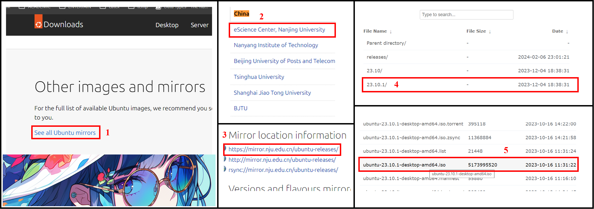
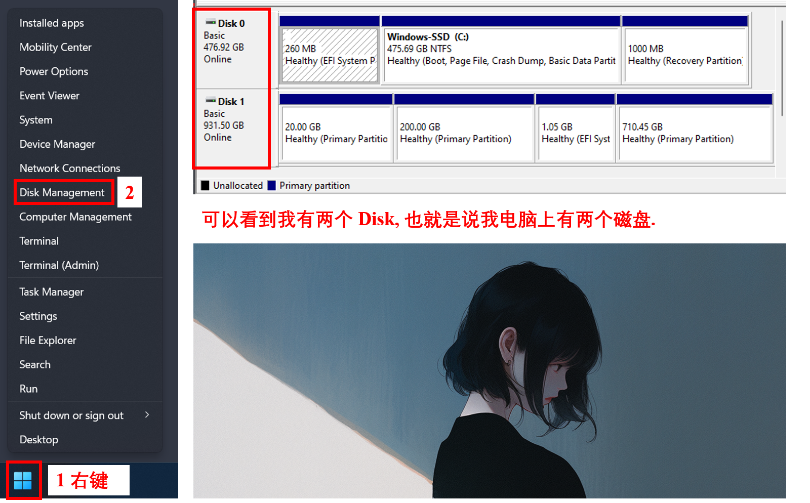
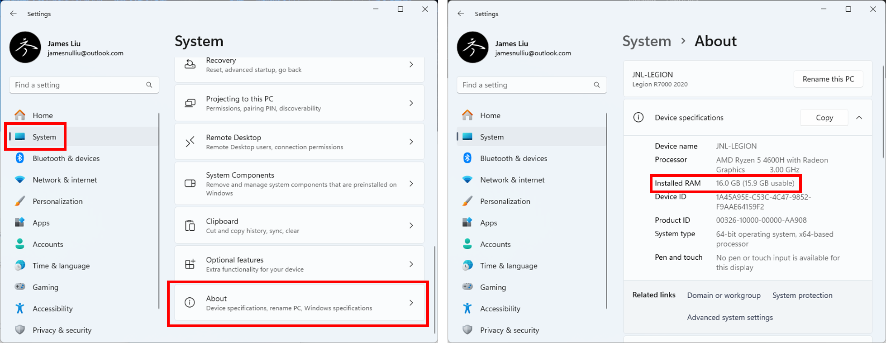
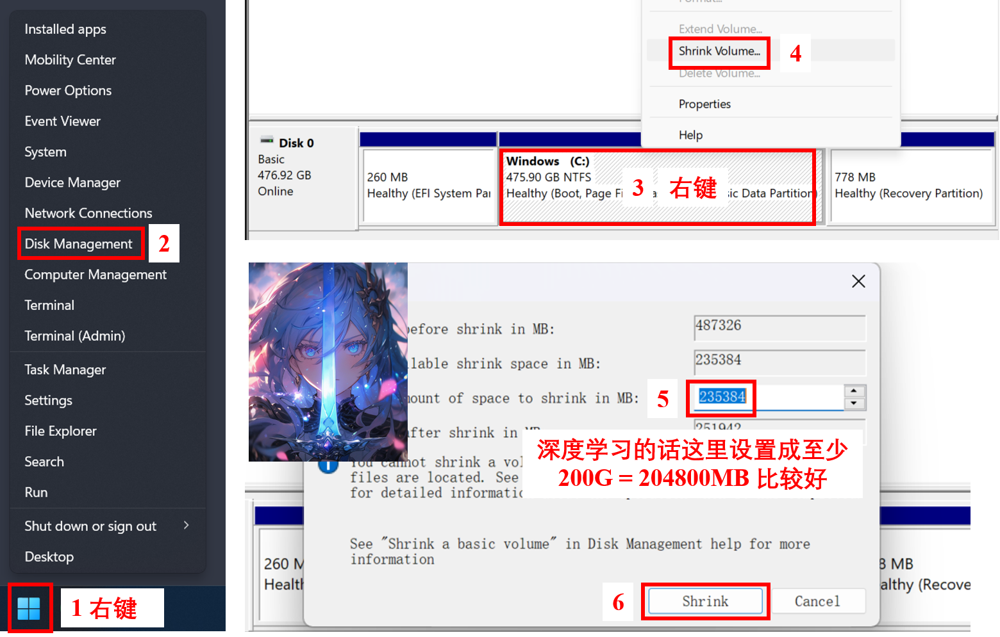
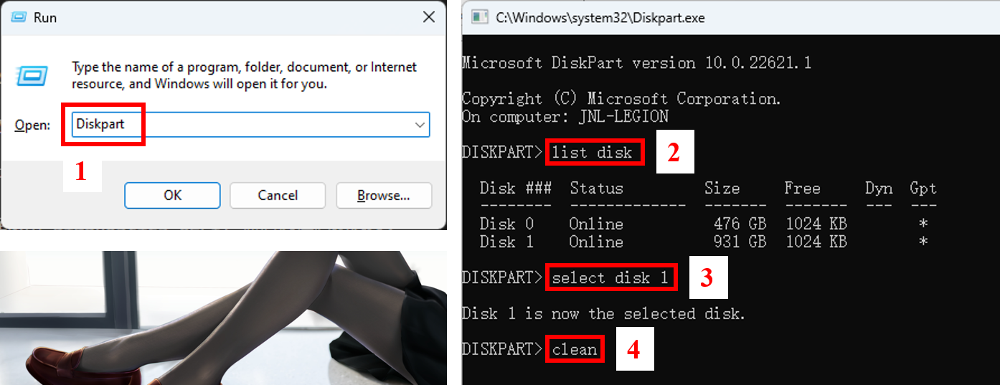
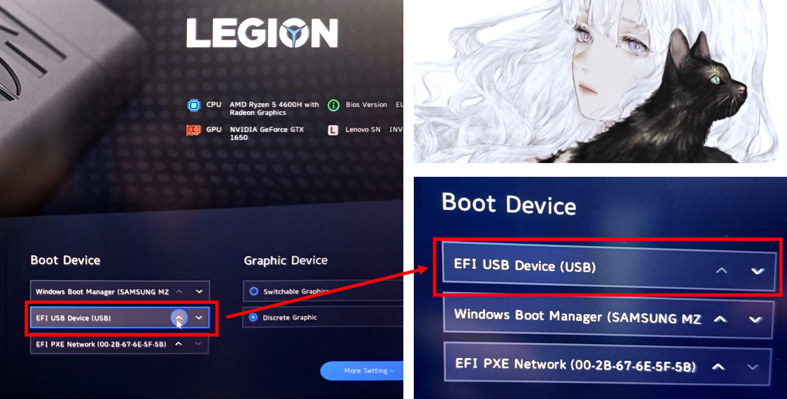

# Reset Your Windows and Install Ubuntu

## 1. 重置 Windows

先把重要的东西备份好.

根据下图步骤重置你的 Windows.

</img>


注意, 在 Step 8, 如果你有多个磁盘, 建议把别的磁盘也给格式化了.

## 2. 下载 Ubuntu Desktop

进入 https://ubuntu.com/download/desktop .

Ubuntu 23 比较好看, 所以接下来我准备下载 23. 你也可以选择下载 22.

官方源不翻墙下载太慢了. 推荐从镜像源下载.

向下滑动页面, 找到并点击下图中的 "see our alternative downloads".

</img>


然后根据下图翻翻翻, 点点点, 下载 "ubuntu-23.10.1-desktop-amd64.iso".

</img>

选择从南京大学的镜像站下载是因为我自己用下来感觉最快. 你可以根据自己的网络环境选择其他的镜像站.

## 3. 制作启动盘

准备一个大于 16G 的闲置U盘. 等会U盘会被格式化, 所以里面别放重要的东西.

下载 Rufus, 网址: https://rufus.ie/en/ .

用起来很简单, 选择你的U盘, 选择前面下载好的 iso, 点 START.

## 4. 装双系统
分两种情况:  
**情况 1**: 你的电脑只有一个磁盘 (这里磁盘我们讲的是 SSD, 如果你的第二磁盘是机械硬盘就比较复杂...要自己挂载不同的分区), 我们就把 Ubuntu 和 Windows 都装在你的 C 盘里;  
**情况 2**: 你的电脑有两个 (多个) 磁盘, 我们就一个磁盘装一个操作系统.

### 4.1. 看自己有多少磁盘

</img>

### 4.2. 看自己的内存大小

</img>

可以看到我的电脑 RAM 是 16 GB.

### 4.3. 安装双系统前的准备工作

#### 4.3.1. 情况 1: 如果只有一个磁盘, 释放 C 盘的一部分空间

看图操作即可.

如果你的 SSD 明明有很多容量, 但是能够 shrink 的部分很小 (比如 475G 只能 shrink 100G), 强烈建议重装一下 Windows.

</img>

#### 4.3.2. 情况 2: 如果有多磁盘, 释放准备装 Linux 的磁盘

参考下面的图做以下几件事情: 

1. Win + R 打开 Run.
2. 输入 "Diskpart".
3. 输入命令:
    ```bash
    list disk
    ```
    **注意: 不要释放掉安装了 Windows 的磁盘.**
4. 找到额外的磁盘, 比如我希望把 Linux 安装在 Disk 1 中, 就执行下面两条命令把 Disk 1 释放掉:
    ```bash
    select disk 1  # Choose the disk where you want to install Linux.
    clean  # "Clean" the disk, aka. free and format the disk.
    ```

</img>

### 4.4. 开始安装 Linux

接着开始正式装双系统了.

在你的电脑上插好前面制作的启动盘.

关机.

开机, 同时疯狂按 F2 进入 Bios 模式.

然后你需要想办法更改启动选项为 USB (也就是刚刚做的启动盘).

不同电脑的更改方式不一样, 比如联想的电脑可以参考下图:

</img>

惠普的电脑, 先要选择退出 Hardware Diagnostics UEFI, 然后选择启动选项:

</img>

**注意: 启动时, 如果系统问你选择用什么 boot 模式, 记得选 normal mode 而非 grub2 mode.**

### 4.5. 情况 1: 只有一个磁盘, 在同一磁盘装双系统

安装参考下面的步骤 (不同版本 Ubuntu 可能顺序不一样, 不过大差不差):

</img>

### 4.6. 情况 2: 有多个磁盘, 一个装 Windows 一个装 Linux

安装参考下面的步骤 (不同版本 Ubuntu 可能顺序不一样, 不过大差不差):

</img>

