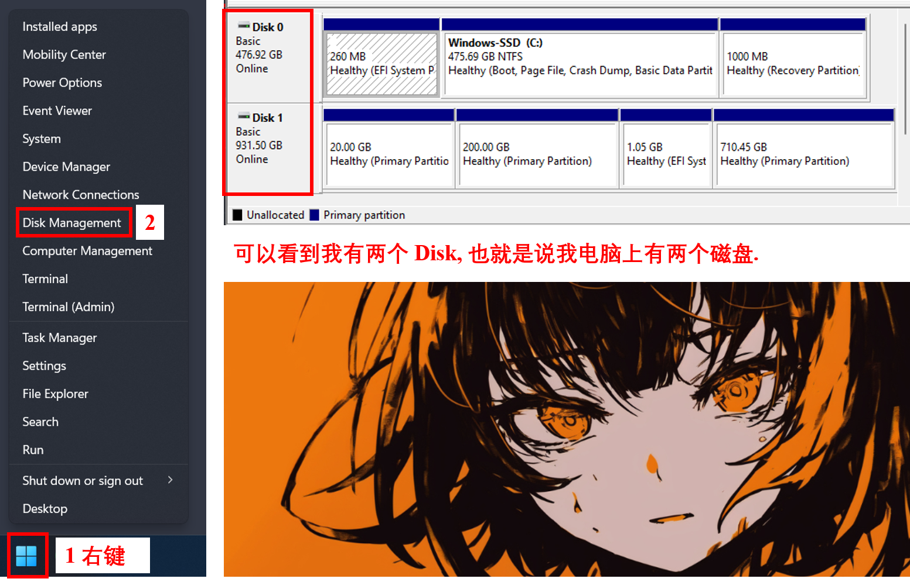

# Reset Your Windows and Install Ubuntu

## 1. 重置 Windows

先把重要的东西备份好.

根据下图步骤重置你的 Windows.

</img>

注意, 在 Step 8, 如果你又多个磁盘, 建议把别的磁盘也给格式化了.

## 2. 下载 Ubuntu Desktop

进入 https://ubuntu.com/download/desktop .

Ubuntu 23 比较好看, 所以接下来我准备下载 23. 你也可以选择下载 22.

官方源不翻墙下载太慢了. 推荐从镜像源下载.

向下滑动页面, 找到并点击下图中的 "see our alternative downloads".

</img>

然后根据下图翻翻翻, 点点点, 下载 "ubuntu-23.10.1-desktop-amd64.iso".

</img>

选择从南京大学的镜像站下载是因为我自己用下来感觉最快. 你可以根据自己的网络环境选择其他的镜像站.

## 3. 制作启动盘

准备一个大于 16G 的闲置U盘. 等会U盘会被格式化, 所以里面别放重要的东西.

下载 Rufus, 网址: https://rufus.ie/en/ .

用起来很简单, 选择你的U盘, 选择前面下载好的 iso, 点 START.

## 4. 装双系统
分两种情况:  
**情况 1**: 你的电脑只有一个磁盘 (这里磁盘我们讲的是 SSD, 如果你的第二磁盘是机械硬盘就比较复杂...要自己挂载不同的分区), 我们就把 Ubuntu 和 Windows 都装在你的 C 盘里;  
**情况 2**: 你的电脑有两个 (多个) 磁盘, 我们就一个磁盘装一个操作系统.

关于如何看自己有多少磁盘:

</img>

在你的电脑上插好前面制作的启动盘.

关机.

开机, 同时疯狂按 F2 进入 Bios 模式.

然后你需要自己探索如何更改启动选项, 改成启动 USB.

**启动时, 如果系统问你选择用什么 boot 模式, 记得选 normal mode 而非 grub2 mode.**

举个例子, 联想的电脑能直接改, 可以参考下图:

惠普的电脑, 先要选择退出 Diagnostics UEFI, 然后选择启动选项:

</img>

安装参考下面的步骤 (不同版本 Ubuntu 可能顺序不一样, 不过大差不差):

</img>

